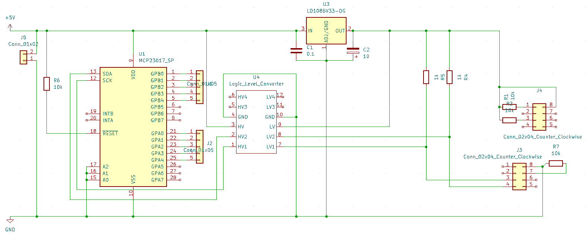

# qclock2
Code, Schematics, Photos of the WortUhr Hack

The WORTUHR is a clock that displays the current time in form of glowing words.
This is about the German variant.

Note: The instance I got is presumably a cheap copy of a more expensive design https://qlocktwo.com/.

## Original Design

There is a metal cover of size 20cm x 20cm.
25 German words are blanked out.
It has a DC 5V 1A power connector and two buttons (`+`) and (`-`).
The plastic housing is 4 cm thick and encloses the metal sheet completey.
Inside there is a PCB whith 25 LED-groups, one group per word, with varying number of LEDs per group.
There's further two groups with each five LED drivers (transitor and multiple resistors), one IC, a quartz and few other passive components.
After powering the the PCB, the clock displays 12:00 ("ES IST ZWÖLF UHR").
The time can be adjusted using the two buttons.

## Problem

The problem with the original product is that it does reset every time power is disconnected.
That makes it inconvenient to use occasionally.

## Idea

Implement some circuit that synchronizes the time via NTP.

## Implementation

The original driver chip has been unsoldered, the 10 transistors on the board have been soldered to cables and dupont-connectors.

A 8266 and MCP23017 are connected via I²C.
The MCP keeps the time and synchronizes regularly via WIFI and NTP.
Since the watch works at 5V and the 8266 at 3.3V, a two-channel bidirectional logic level converter is required to translate the I²C signals.

Porting the breadboard to a sodered board turned out messy, error-prone and cumbersome.
Ordering a printed PCB seems to be the better choice.

kicad-files can be found in the repo:

